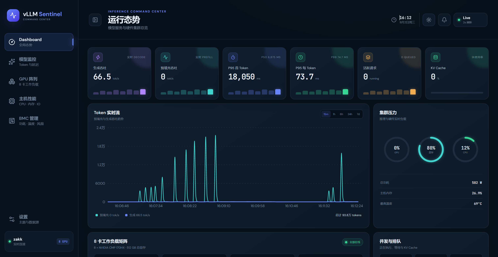
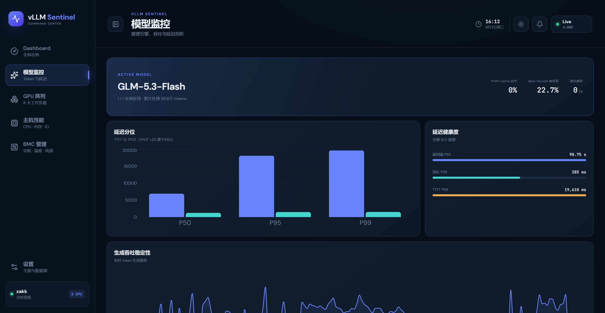
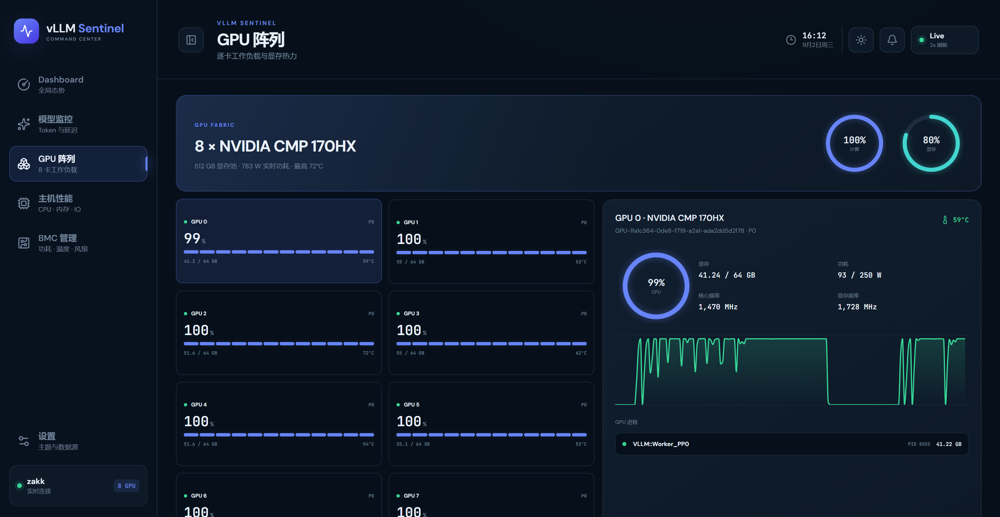
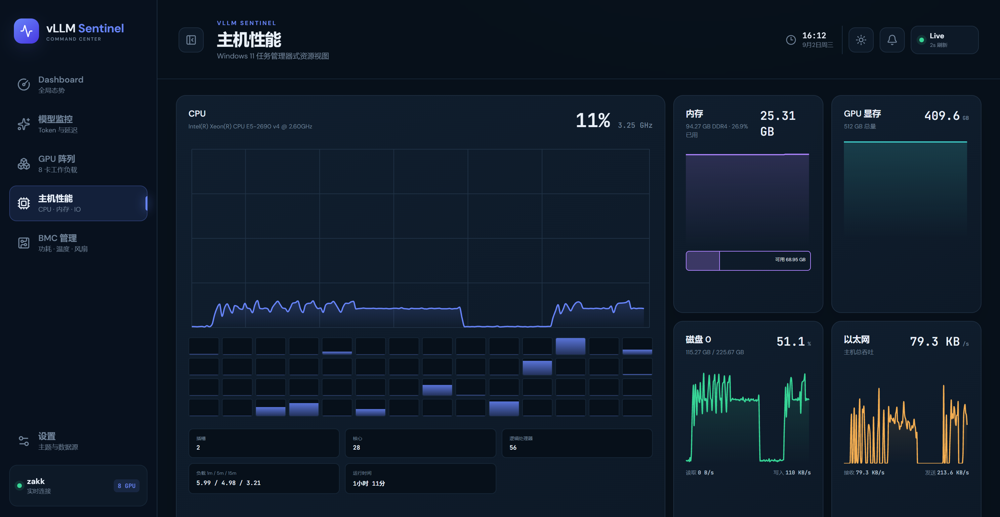
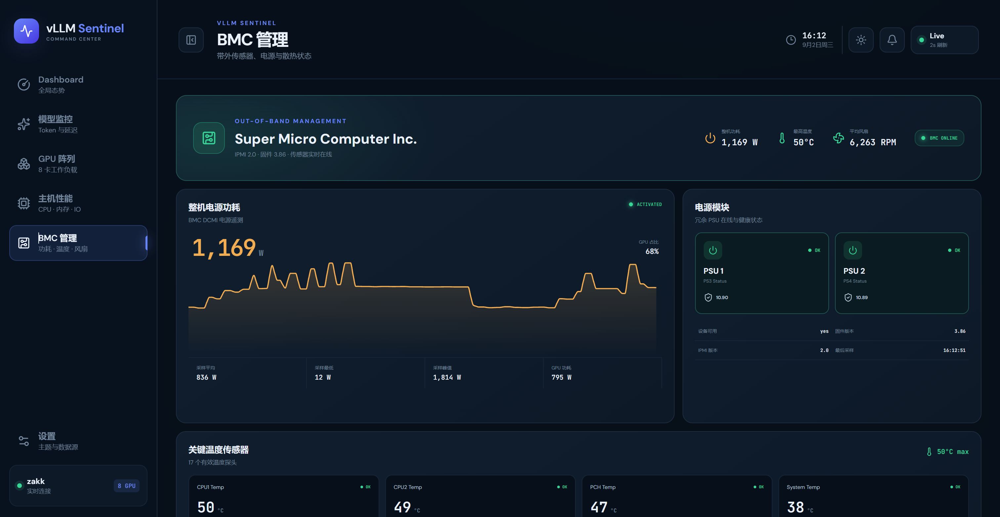

# vLLM Sentinel

面向多 GPU vLLM 推理机的实时监控控制台。一个 Docker 命令拉起，同时看模型吞吐/延迟、GPU 阵列、主机资源和 BMC 功耗。

截图来自 `8 × NVIDIA CMP 170HX` 上的 `GLM-5.3-Flash` 生产实例。

## 效果图

### 运行态势

总览生成/预填充吞吐、TTFT/TPOT、排队、KV Cache，以及 GPU/CPU/整机功耗。



### 模型监控

实例在线状态、P50/P95/P99 延迟、端到端延迟、Prefix Cache 和 Spec Decode 接受率。



### GPU 阵列

逐卡利用率、显存、温度、功耗、频率和 GPU 进程。



### 主机性能

CPU 逐逻辑处理器、内存、GPU 显存、磁盘 IO 和网卡吞吐。



### BMC 管理

整机 DCMI 功耗、CPU/PCH/系统温度、风扇、电源模块和 IPMI 信息。



## 功能

- Dashboard：生成/预填充吞吐、Token 总量、TTFT、TPOT、并发、排队、KV Cache
- 模型监控：多 vLLM 实例、延迟分位、缓存命中、Spec Decode
- GPU 阵列：每张卡独立展示，不依赖 DCGM Exporter
- 主机性能：CPU / 内存 / 磁盘 / 网络
- BMC 管理：独立无网络采集容器，只读 `/dev/ipmi0`
- 2 秒 SSE 实时推送，SQLite 保存 15 分钟到 7 天历史
- 深海蓝 / 石墨黑 / 月光白主题

## 快速开始

需要 Linux、Docker Compose、NVIDIA Container Toolkit，以及本机可达的 vLLM `/metrics`。

```bash
cp .env.example .env
# 修改 VLLM_ENDPOINTS 指向你的 vLLM
docker compose up -d --build
```

打开 `http://服务器地址:8733`。

```dotenv
VLLM_ENDPOINTS=[{"name":"GLM-5.3-Flash","url":"http://127.0.0.1:9004"}]
```

可同时监控多个实例；`api_key` 可选。控制台只读 `/metrics`，不会代理聊天，也不会改模型服务。

鉴权由 `DASHBOARD_AUTH_ENABLED` 控制。内网可关，对公网请打开并设置强密码。

## 接口

- `GET /api/health`
- `GET /api/state`
- `GET /api/stream`
- `GET /api/history?range=1h`

## License

MIT
